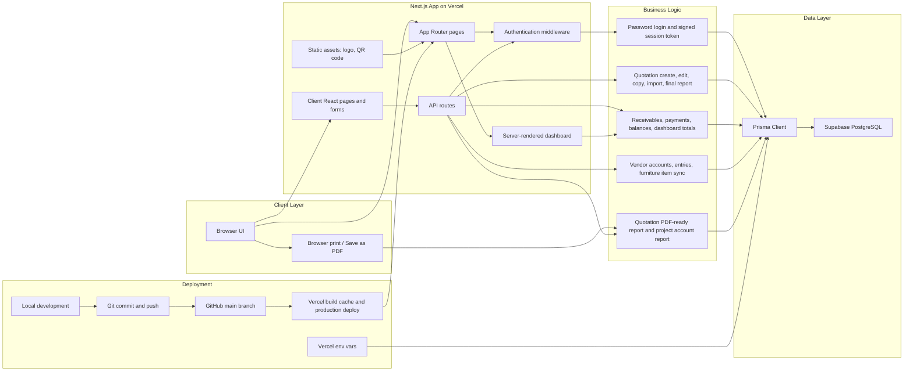

# Space Shastra Interiors - Architecture Diagram

This diagram describes the application architecture from browser to database and deployment automation.

## Current Technology Stack

- Next.js 14 App Router
- React 18
- TypeScript
- Tailwind CSS
- Prisma ORM
- Supabase PostgreSQL
- Vercel hosting
- GitHub deployment source

## Security Boundary

- Public repository contains source code, diagrams, assets, and schema.
- Secrets are not committed.
- Production secrets live in Vercel environment variables.
- Production business data lives in Supabase, not in GitHub.

## Important Runtime Flows

- Login creates a signed auth token stored as a browser cookie.
- Middleware protects app pages and API routes from unauthenticated access.
- Pages and forms call Next.js API routes.
- API routes use Prisma to read and write Supabase PostgreSQL data.
- Quotation final report is rendered in the browser and exported through browser print or Save as PDF.
