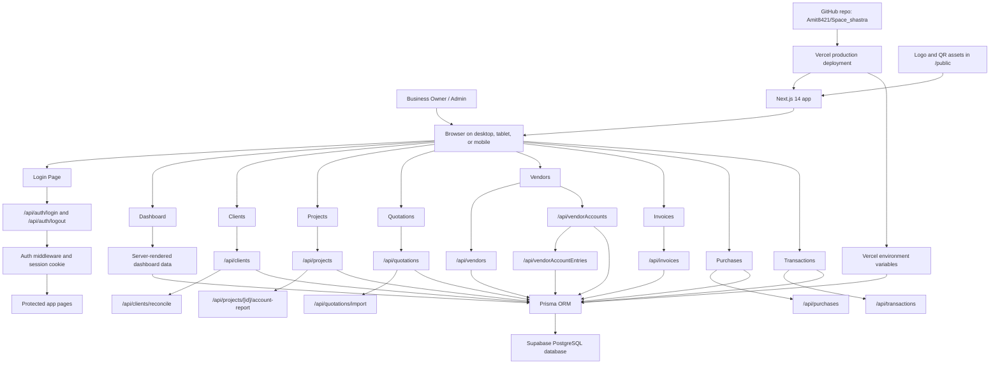

# Space Shastra Interiors - System Diagram

This diagram shows the major users, screens, API routes, database, and deployment services in the current web application.

## Main Data Areas

- Client records and client balances
- Project/site records
- Quotations with itemized interior work
- Copy quotation workflow for new clients
- Vendor accounts, vendor furniture items, and vendor balances
- Invoices, payments, purchases, and transactions
- Dashboard totals for client receivables and vendor outstanding balances

## External Services

- GitHub stores application source code and deployment documentation.
- Vercel hosts the web application and runs production builds.
- Supabase hosts the PostgreSQL database.
- Vercel environment variables store database and login secrets.
