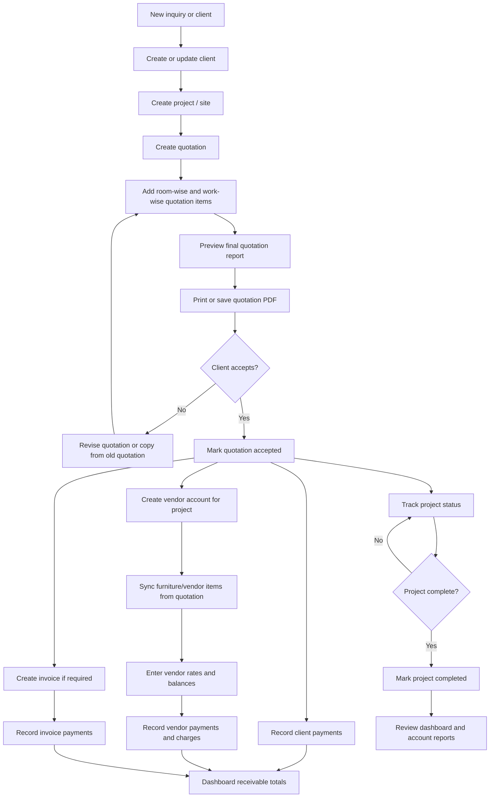
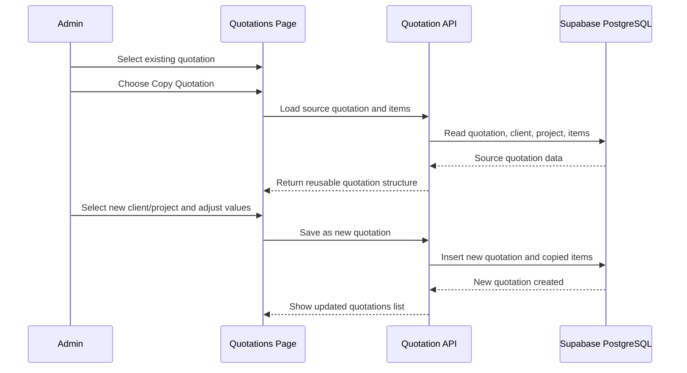
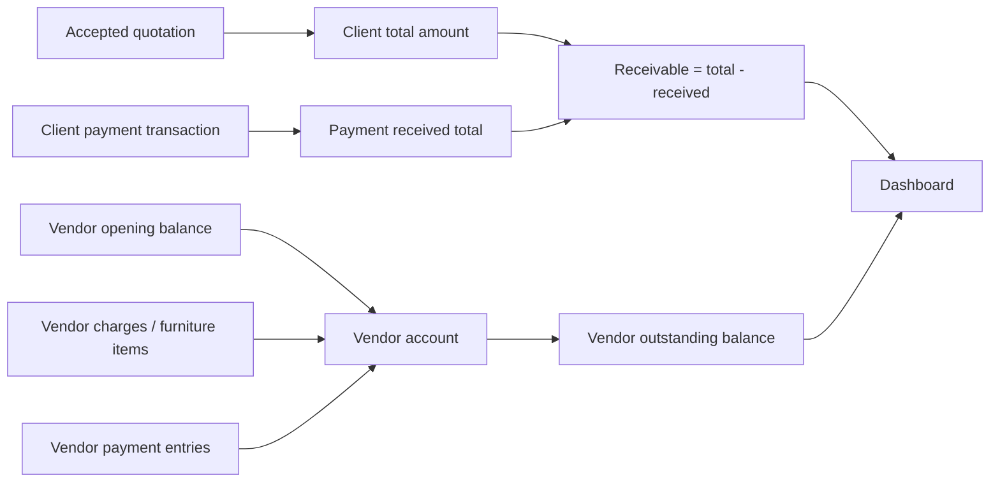
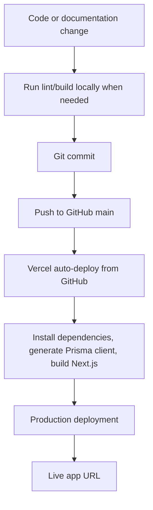

# Space Shastra Interiors - Workflow Diagram

This file maps the current business workflows handled by the application.

## Overall Business Workflow

## Quotation Copy Workflow

## Payment And Balance Workflow

## Deployment Workflow

## Enhancement Areas To Compare With Competitors

- Lead capture and follow-up tracking
- Measurement sheets and site survey forms
- Material catalog and rate library
- BOQ and estimate versioning
- Client approval workflow with digital signature
- Automated payment reminders
- Vendor purchase orders and delivery tracking
- Project timeline, tasks, and milestone tracking
- Photo/document uploads per project
- WhatsApp/email quotation sharing
- Role-based access for staff, designer, accountant, and vendor
- Analytics for profit, margin, conversion, and pending collections
